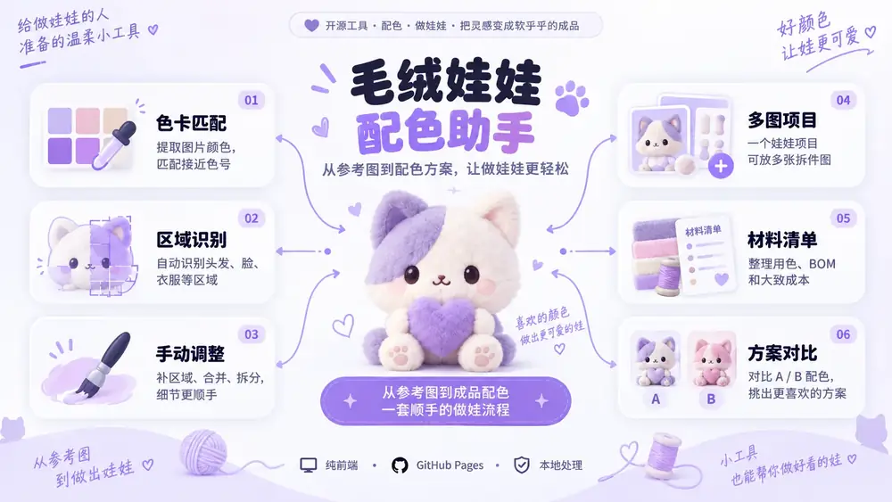

<div align="center">

# 🧸 毛绒娃娃配色助手

**从参考图到配色方案，让做娃娃更轻松。**

一个面向毛绒娃娃设计、配色与制作整理的纯前端小工具。  
帮你从设计图中识别颜色和区域，在不同色卡中寻找接近色号，并把配色一步步整理成可以真正拿去做娃的方案。

[🌷 在线使用](https://invoidstar.github.io/color-matcher/) · [📖 使用说明](https://invoidstar.github.io/color-matcher/guide.html)

</div>

<p align="center">
  
</p>

---

## ✨ 这个工具可以做什么？

毛绒娃娃配色助手不是为了做复杂的图像分析，而是希望解决做娃过程中一些很实际的小麻烦：

- 参考图里到底用了哪些颜色？
- 这些颜色在手头的毛线 / 绣线色卡里最接近哪个色号？
- 嘴巴、眼睛、小装饰漏识别了怎么办？
- 左右耳、左右眼等重复部件怎样保持同色？
- 一个娃娃有多张拆件图，怎样放在同一个项目里整理？
- 两套配色都很好看，怎样直观比较？
- 最后需要哪些颜色、多少种颜色、哪些部件使用同一个色号？


---

## 🎨 内置色卡

目前内置三套色卡，可以随时切换，也可以在同一区域上进行跨色卡比较。

| 色卡 | 色数 | 说明 |
| --- | ---: | --- |
| **樱花** | 600 | 原 001–480 保持不变，本次按方案 A 补充 TQ481–TQ600 |
| **涵特** | 720 | HANTE 120D/2 高速绣花线色卡，现已完整录入 001–720 |
| **亚丽丝** | 1680 | 12 张实拍色卡整理而成；保留厂家色号候选与 AL 内部编号 |

> 色卡来自图片采样，实际颜色仍会受到拍摄光线、白平衡、显示器、线材材质和批次影响。网站给出的是视觉近似匹配，最终制作建议结合实物色卡确认。

除了内置色卡，也支持通过 **色卡管理器** 导入规则网格色卡、导入 / 导出色卡 JSON，并进行简单校准。

---

## 🪡 一套比较顺手的做娃流程


### 1. 上传设计图

上传平面拆件图、角色设定图或其他参考图。  
一个项目可以加入多张图片，例如头部、身体、衣服和配件。

### 2. 自动识别区域

系统会先区分：

- **主区域**：头发、衣服、帽子、大块配件等；
- **细节区域**：嘴巴、眼睛、小装饰等。

相同颜色但彼此分离的部件仍然可以分别保留。

### 3. 手动微调

自动识别不需要做到 100% 完美。少量异常可以直接在工作台修正：

- **补区域**：点击漏掉的嘴巴、小装饰等区域；
- **画笔＋**：给当前区域补回缺失部分；
- **橡皮**：擦掉识别多余的部分；
- **合并**：把被分碎的同一部件重新合起来；
- **拆分**：把误连在一起的部件切开；
- **联动**：让左右耳、左右眼等重复部件同步使用同一色号。

### 4. 比较色卡

每个区域会给出最接近的色号、候选色和 ΔE00 色差，并提供匹配可信度提示。

也可以直接比较：

**樱花 / 涵特 / 亚丽丝 / 自定义色卡**

看看哪一套色卡更接近原设计。

### 5. 预览与优化

选好颜色后，可以：

- 生成整图 **配色预览**；
- 保存 **A / B 两套方案**并排比较；
- 使用 **限色优化**减少需要购买的颜色数量；
- 查看低可信度颜色并人工调整。

### 6. 整理清单并开工

最后可以得到：

- 色号列表；
- BOM / 用色清单；
- 区域面积占比；
- 粗略克重 / 团数估算；
- 库存、需购数量、单价和备注；
- 标注图；
- 色卡连线图；
- CSV；
- 打印制作单。

---

## 💜 主要功能

| 功能 | 用途 |
| --- | --- |
| **项目保存 / 恢复** | 保存为 `.plushcolor.json`，下次继续编辑 |
| **多图项目** | 一个娃娃项目同时管理多张拆件图 |
| **主区域 + 细节区域识别** | 自动整理大部件和小细节 |
| **区域编辑器** | 补区域、画笔、橡皮、合并、拆分 |
| **重复部件联动** | 左右 / 重复部件保持一致配色 |
| **CIELAB + CIEDE2000** | 在色卡中寻找视觉上更接近的颜色 |
| **匹配可信度** | 提醒候选接近或色差较大的区域 |
| **跨色卡比较** | 同一区域比较不同色卡的最佳匹配 |
| **配色预览** | 提前看看换成实际色卡颜色后的效果 |
| **A / B 方案** | 保存并比较两套完整配色 |
| **限色优化** | 尽量减少需要购买的颜色种类 |
| **BOM / 采购整理** | 汇总色号、使用部件、面积、库存与成本 |
| **色卡管理器** | 导入、导出、校准自己的色卡 |
| **标注 / 导出** | CSV、PNG、标注图、色卡连线图、打印页 |
| **PWA / 离线** | 支持安装，常用资源可离线使用 |

---

## 📦 项目保存

做娃配色往往不是一次就能完成，所以项目状态可以完整保存。

保存内容包括：

- 多张设计图；
- 自动识别和手动编辑后的区域；
- 区域名称；
- 当前色卡和每个区域的色号；
- 左右 / 重复部件联动关系；
- 自定义色卡；
- A / B 配色方案；
- BOM / 采购相关设置。

浏览器也会通过 IndexedDB 自动保存最近项目，但重要项目仍建议下载一份 `.plushcolor.json` 备份。

---

## 🔒 图片与数据

这是一个 **纯前端** 工具。

设计图、区域编辑、色卡匹配和项目处理默认都在浏览器本地完成，不需要把你的娃稿上传到后端服务器。

- 无后端数据库；
- 无账号系统；
- GitHub Pages 静态部署；
- 支持 PWA / 离线缓存。

---

## 🗂️ 项目结构

```text
color-matcher/
├── index.html
├── guide.html
├── manifest.webmanifest
├── sw.js
├── icon.svg
│
├── assets/
│   └── readme/
│       ├── hero.webp
│       ├── features.webp
│       └── workflow.webp
│
├── css/
│   ├── base.css
│   ├── theme.css
│   ├── features.css
│   └── guide.css
│
├── js/
│   ├── app.js
│   └── core/
│       └── color.js
│
├── data/
│   ├── qqtq-480.js
│   ├── hanter-620.js
│   └── alice-1680.js
│
├── docs/
│   ├── ARCHITECTURE.md
│   ├── PALETTES.md
│   └── USER_GUIDE.md
│
└── .github/
    └── workflows/
        └── deploy-pages.yml
```

项目保持 **no-build / 无后端** 的静态架构，不需要 npm 或打包器。

---

## 🏠 本地运行

克隆仓库后，在项目目录启动任意静态服务器即可：

```bash
python -m http.server 8000
```

然后访问：

```text
http://localhost:8000/
```

---

## 📖 使用说明

第一次使用建议先阅读完整说明书：

**[毛绒娃娃配色助手 · 使用说明](https://invoidstar.github.io/color-matcher/guide.html)**

其中详细介绍了每一个按钮、区域编辑方式、色卡管理、BOM、限色优化、A/B 方案以及常见问题。

---

<div align="center">

### 🌷 从参考图，到真正做出喜欢的娃娃。

**看图 · 配色 · 调整 · 做娃**

[开始使用](https://invoidstar.github.io/color-matcher/)

</div>
