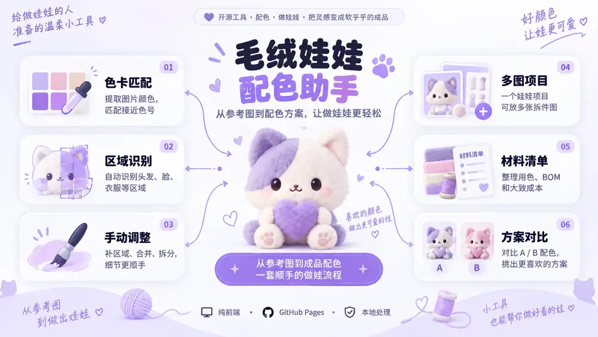

# 🎨 Color Matcher · 毛绒娃娃配色助手

**让每一块颜色，都找到合适的色号。**

[🌷 在线工作台](https://invoidstar.github.io/color-matcher/) ·
[🎨 色卡浏览](https://invoidstar.github.io/color-matcher/palette.html) ·
[📖 使用说明](https://invoidstar.github.io/color-matcher/guide.html) ·
[💌 留言反馈](https://invoidstar.github.io/color-matcher/guestbook.html)

## ✨ v4.0 工作台更新

本次重构以操作体验和手机端可用性为核心，不仅是更换配色。

- **桌面端**：突出画布与右侧区域列表，统一导航、按钮、弹窗和结果区视觉。
- **手机端**：使用画布 / 区域 / 结果三段式底部导航，无需反复滚动寻找各类功能。
- **画布操作**：支持缩放、适应屏幕和移动模式；手机端在移动模式中可以拖动和双指缩放。
- **功能整理**：常用编辑工具放在主栏，合并、联动等放在「更多区域操作」，高级识别设置默认收起。
- **功能精简**：移除 BOM、库存、用量 / 团数估算、采购与成本优化，保留限色优化和原有其他输出。

## 🪡 当前功能

1. 导入一张或多张设计图，建立多图配色项目。
2. 自动识别主区域与细节区域，独立保留物理上分开的同色部件。
3. 修正漏检和误检：补区域、画笔、橡皮、合并、拆分、重复部件联动。
4. 按 RGB → Lab 与 CIEDE2000 匹配色号，展示候选色差与可信度。
5. 对比不同色卡，预览颜色替换、保存 A/B 方案或执行限色优化。
6. 导出色号 CSV、配色预览 PNG、编号标注 PNG、色卡连线图，或打印配色参考单。
7. 保存或恢复 `.plushcolor.json` 项目；浏览器内使用 IndexedDB 自动保存最近项目。

## 🎨 内置色卡

| 色卡 | 数量 | 说明 |
|---|---:|---|
| 樱花 | 600 | QQ001–QQ360、TQ361–TQ600，新版 5 张图重新采样 |
| 涵特 | 720 | HANTE 120D/2，完整 001–720 |
| 亚丽丝 | 1680 | 保留 AL 编号与厂商别名，101 / 102 / 1786 已校准 |

色卡来自图片采样，线材的实际颜色可能受拍摄光线、显示设备、材质和批次影响。可导入自己的自定义色卡。

## 💌 留言反馈（v4.1）

新增独立留言页面：免登录发布使用体验、问题反馈与功能建议；通过 Turnstile 人机验证后展示，支持分页和站长回复。
昵称与留言正文是公开内容，请勿填写个人敏感信息。站长使用 GitHub OAuth 进入独立管理后台，支持回复、隐藏、恢复与删除。
留言板采用 Cloudflare Workers + D1，与原有浏览器端配色计算隔离。

## 📱 手机端如何操作？

在画布工作区上传图片并选中区域；切换「区域」可查看、修改颜色；切换「结果」可完成预览、对比和导出。

需要移动或放大画布时，开启 **移动画布**：单指拖动、双指缩放。关闭移动模式后重新使用选择、画笔或橡皮。

## 💾 数据安全和旧项目兼容

配色工作台仍是 GitHub Pages 静态工具，图像分析、色卡匹配、区域编辑均在浏览器本地完成。留言反馈功能使用独立的 Cloudflare Worker / D1 后端；公开昵称和留言只由此服务保存，配色项目仍在浏览器本地。请对重要配色项目下载 `.plushcolor.json` 备份。

旧版项目仍可以恢复图纸、区域、色卡、自定义色卡和 A/B 方案；已删除的库存、成本、采购元数据不再维护或写入新项目文件。

留言板已完成管理员真实操作及访客隔离浏览器验收。部署说明和发布验收记录见 [`guestbook-worker/README.md`](guestbook-worker/README.md) 与 [`验收记录`](docs/GUESTBOOK_V1_ACCEPTANCE.md)。流量插件使用不蒜子的**本页 UV/PV** 统计。

## 🛠 本地运行

在仓库目录执行 `python -m http.server 8000`，打开 `http://localhost:8000/`。

主要代码：`index.html`、`css/ui-v4.css`、`js/ui-v4.js`、`js/app.js`、`js/core/color.js`、`data/`。无 npm、无打包器或服务器依赖。
